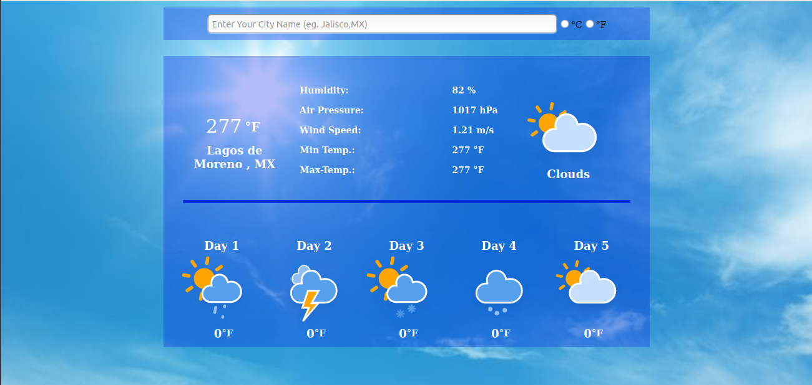
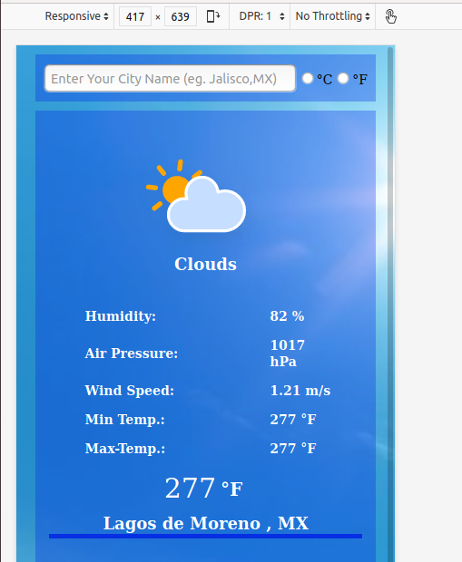

# Weather App

> Project made with javascript and WebPack framework to fetch information from weather using an external API by consulting the name of the city or country.

### Desktop view



### Mobile view



Javascript with Webpack project from [The Odin Project curriculum](https://www.theodinproject.com/courses/javascript/lessons/working-with-apis)

## Built With Javascript and Webpack

- Html,Css,JavaScript
- Webpack
- npm manager
- HTTP Request

## Live Demo

[Live Demo Link](https://mephistodevelop.github.io/WeatherAppExample/)

## Future Features:

- Auto-populate your current location
- Change background according to the current weather

## Getting Started

### Prerequisites

-Before running this project you will need to install webpack and configure the live server on your webpack.config file. You can learn more about it on this [page](https://webpack.js.org/guides/installation/).

[npm install and config: ](https://docs.npmjs.com/cli/install)

### Setup

To use this project you will need to download this repository onto your computer. Afterwards, you will need to install webpack and npm to correctly run this project. In the package.json file, input this

in `package.json` file on the rules we are going to put this:

```
 "scripts": {
 "test": "echo \"Error: no test specified\" && exit >1",
 "build": "webpack --mode production",
 "builddev": "webpack --mode development",
 "start": "webpack-dev-server --mode development >--open"
 }
```

In the `webpack.config.js` file we are going to input this config in order to use live-sync browser reloaded automatically using `npm run start`

```
const path = require('path');
const BrowserSyncPlugin = require('browser-sync-webpack-plugin');

module.exports = {
entry: './src/index.js',
output: {
filename: 'main.js',
path: path.resolve(\_\_dirname, 'dist'),
},
watch: true,
module: {
rules: [
{
test: /\.css$/,
        use: ['style-loader', 'css-loader'],
      },
      {
        test: /\.(png|svg|jpg|gif)$/,
use: ['file-loader'],
},
],
},
};

module.exports = {
watch: true,
plugins: [
new BrowserSyncPlugin({
host: 'localhost',
port: 3001,
files: [
'./dist/*.html',
'./dist/*.js',
'./dist/*.css',
'./src/*.js',
'./src/img/*.jpg',
],
server: { baseDir: ['dist'] },
}),
],
};
```

### Deployment

To deploy the application and view it on your browser, open your project folder terminal and run these command:" ; "To run the linter files you will need to run these command on the terminal

```
`npm install`
`npm run build`
`npm i -D webpack-dev-server`
`npm i browser-sync --save`

`npm install eslint eslint-config-airbnb --save-dev`
`npx eslint --init`
`npx client`
```

after you will need to enter to [Stickler Page](https://stickler-ci.com/) and activate your repository.

## Author

👤 **Cristian Ines Hernandez A. - MephistoDevelop**

- Github: [@MephistoDevelop](https://github.com/MephistoDevelop)
- Twitter: [@MephistoDevelop](https://twitter.com/MephistoDevelop)
- Linkedin: [Cristian Hernandez](https://www.linkedin.com/in/cristian-hernandez1992/)

## 🤝 Contributing

Contributions, issues, and feature requests are welcome!

Feel free to check the [issues page](issues/).

## Show your support

Give an ⭐️ if you like this project!

## 📝 License

This project is [MIT](lic.url) licensed.
